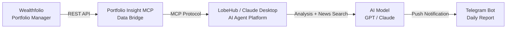

# Portfolio Insight MCP

A [Model Context Protocol (MCP)](https://modelcontextprotocol.io/) server that bridges [Wealthfolio](https://wealthfolio.app/) portfolio data to AI agents. Enables AI platforms like [LobeHub](https://lobehub.com/) or Claude Desktop to query daily/weekly P&L and per-holding details, then perform analysis and push reports to Telegram.

## Use Case

A typical workflow: LobeHub's scheduled agent calls this MCP server every morning to fetch portfolio data from Wealthfolio, analyzes market movements with AI, and sends a daily investment report to Telegram.



### Call Flow

```
┌─────────────┐      ┌──────────────────────┐      ┌───────────────────┐
│ Wealthfolio │ ───► │ Portfolio Insight MCP │ ───► │ AI Agent (LobeHub)│
│ (Data Source)│ REST │ (MCP Server)         │ MCP  │                   │
└─────────────┘      └──────────────────────┘      └────────┬──────────┘
                                                             │
                                                    ┌────────▼──────────┐
                                                    │ Analyze holdings   │
                                                    │ Search market news │
                                                    │ Generate report    │
                                                    └────────┬──────────┘
                                                             │
                                                    ┌────────▼──────────┐
                                                    │ Telegram Bot       │
                                                    │ Push daily report  │
                                                    └───────────────────┘
```

**Workflow:**

1. **Data Fetching** — Portfolio Insight MCP pulls holdings, P&L from Wealthfolio's REST API
2. **MCP Exposure** — Data is exposed as standardized MCP Tools that any AI agent can call
3. **AI Analysis** — The AI agent invokes MCP Tools, combines data with internet news for comprehensive analysis
4. **Scheduled Push** — Via scheduled workflows (e.g., LobeHub cron), generates and pushes daily investment reports to Telegram

## Architecture

The project follows **Domain-Driven Design (DDD)** with a clean layered structure:

```
.
├── main.go                          # Entry point
├── internal/
│   ├── domain/portfolio/            # Domain layer: entities & repository port
│   ├── application/                 # Application layer: use-case orchestration
│   └── infrastructure/
│       ├── config/                  # Configuration loader
│       ├── wealthfolio/             # Infrastructure: Wealthfolio REST client
│       └── mcp/                     # Interface: MCP server (tool registration)
├── Dockerfile                       # Multi-stage distroless container
└── .github/workflows/               # CI/CD pipelines
```

| Layer | Responsibility |
|-------|---------------|
| **Domain** | Core business entities (`Holding`, `Account`, `HoldingDetail`) and repository interface |
| **Application** | Orchestrates use cases: daily P&L, weekly P&L, holdings detail |
| **Infrastructure** | External integrations (Wealthfolio HTTP client, config, MCP server) |

## MCP Tools

| Tool | Description |
|------|-------------|
| `refresh_portfolio` | Trigger market quote sync + portfolio recalculation; must call before querying stale data |
| `get_daily_gain_loss` | Yesterday's P&L: total amount, %, total value, per-account breakdown |
| `get_portfolio_overview` | Portfolio snapshot: total market value, cost basis, gain/loss, day/week/month change |
| `get_asset_allocation` | Allocation by asset class with market value, gain/loss, weight |
| `get_holdings_detail` | Full per-holding details across all accounts (with 7-day/30-day price change %) |
| `get_recent_activities` | Recent transactions (buy/sell/dividend/deposit/withdrawal) sorted by date desc, with optional `limit` param |

### Response Fields

**Holdings Detail** includes: `accountName`, `symbol`, `name`, `assetClass`, `currency`, `quantity`, `price`, `marketValue`, `costBasis`, `dayChange`, `dayChangePct`, `weekChangePct`, `monthChangePct`, `totalGain`, `totalGainPct`, `weight`, `asOfDate`.

**Activity** includes: `id`, `accountName`, `date`, `activityType`, `symbol`, `symbolName`, `quantity`, `unitPrice`, `amount`, `fee`, `currency`.

## Wealthfolio API Endpoints Used

This server consumes the following Wealthfolio REST API endpoints:

| Method | Endpoint | Purpose |
|--------|----------|---------|
| GET | `/api/v1/auth/status` | Check if authentication is required |
| POST | `/api/v1/auth/login` | Login and obtain session token |
| GET | `/api/v1/accounts?includeArchived=false` | List active accounts |
| POST | `/api/v1/holdings/query` | Query holdings (all or by account) |
| POST | `/api/v1/performance/accounts/simple` | Get daily performance per account |
| POST | `/api/v1/performance/history` | Get period performance metrics |
| GET | `/api/v1/market-data/quotes/history?symbol=` | Get historical price quotes |
| POST | `/api/v1/portfolio/update` | Trigger portfolio refresh (async) |
| GET | `/api/v1/events/stream` | SSE stream for async task completion events |
| POST | `/api/v1/activities/search` | Search activities with pagination & filters |

## Agent Prompt

An English-language agent prompt file is available at [`PROMPT.md`](./PROMPT.md). It provides AI agents with complete instructions on how to use the MCP tools, the recommended workflow, message format examples, and guidelines for portfolio analysis and Telegram reporting.

## Prerequisites

- A running [Wealthfolio](https://wealthfolio.app/) instance (self-hosted or cloud)
- Go 1.23+ (for local development)
- Docker (optional, for containerized deployment)

## Configuration

Copy `.env.example` to `.env` and fill in values:

```bash
cp .env.example .env
```

| Variable | Required | Description |
|----------|----------|-------------|
| `WEALTHFOLIO_BASE_URL` | Yes | Base URL of your Wealthfolio instance |
| `WEALTHFOLIO_PASSWORD` | No | Password if Wealthfolio auth is enabled |
| `MCP_TRANSPORT` | No | `stdio` or `http` (default `http`) |
| `MCP_ADDR` | No | Listen address for HTTP mode (default `:8080`) |
| `MCP_AUTH_TOKEN` | No | Bearer token for HTTP mode authentication |
| `LOG_LEVEL` | No | `debug`, `info`, `warn`, `error` |

## Running Locally

```bash
# Install dependencies
go mod download

# Run in HTTP mode (default, Streamable HTTP transport)
go run .

# Run in stdio mode (for MCP client integration, e.g., Claude Desktop)
MCP_TRANSPORT=stdio go run .
```

## Docker

```bash
# Build
docker build -t portfolio-insight-mcp .

# Run (HTTP mode)
docker run --rm --env-file .env -p 8080:8080 portfolio-insight-mcp
```

## Deployment

### Option 1: HTTP Mode (Docker)

Pre-built multi-arch images (`linux/amd64`, `linux/arm64`) are published to GHCR on every tagged release:

```bash
docker pull ghcr.io/orangeboychen/portfolio-insight-mcp:<version>

# Run as HTTP server
docker run --rm --env-file .env -p 8080:8080 ghcr.io/orangeboychen/portfolio-insight-mcp:latest
```

Then configure your MCP client to connect via Streamable HTTP:

```json
{
  "mcpServers": {
    "portfolio-insight": {
      "url": "http://<host>:8080/mcp",
      "headers": {
        "Authorization": "Bearer <your_MCP_AUTH_TOKEN>"
      }
    }
  }
}
```

### Option 2: stdio Mode (Local Binary)

Download the binary from [GitHub Releases](https://github.com/orangeboyChen/portfolio-insight-mcp/releases) or build from source:

```bash
go install github.com/orangeboyChen/portfolio-insight-mcp@latest
```

Then configure your MCP client (e.g., Claude Desktop, LobeHub) to invoke the binary directly:

```json
{
  "mcpServers": {
    "portfolio-insight": {
      "command": "/path/to/portfolio-insight-mcp",
      "env": {
        "WEALTHFOLIO_BASE_URL": "http://your-wealthfolio:3000",
        "WEALTHFOLIO_PASSWORD": "your-password",
        "MCP_TRANSPORT": "stdio"
      }
    }
  }
}
```

## CI/CD

- **CI** (`ci.yml`): Runs lint + tests on every push/PR to `master`
- **Release** (`release.yml`): On `v*.*.*` tags — lint, test, build & push multi-arch Docker image to GHCR, create GitHub Release

## License

MIT
